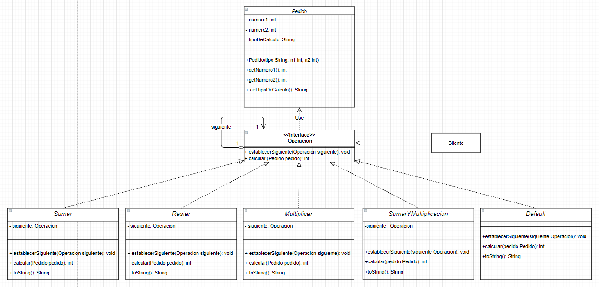

# Chain of responsability

Este problema tiene como objetivo demostrar cómo utilizar el patrón de "cadena de responsabilidad", utilizando para ello un problema simple:

> Se utiliza la función operación, para poder demostrar la ventaja especifica de este patrón.

## Características especiales del problema

1. La clase 'operación' es la supraclase de la cuál heredaran todas las operaciones.
2. Hay que establecer el orden de las operaciones previo a la ejecución del algoritmo.
3. Todos los pedidos irán pasando los niveles de responsabilidad hasta llegar al correspondiente.
4. La clase 'default' se encargará de manejar las excepciones de pedidos no manejados.

## Puntos de extensión

* Se podrían agregar todas las operaciones que se deseen.
